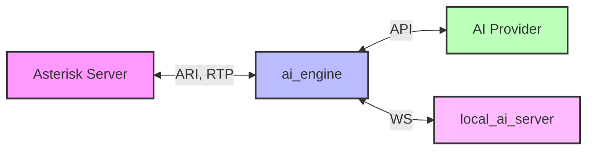
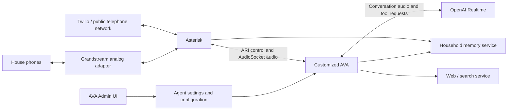

<div align="center">

<picture>
  <source media="(prefers-color-scheme: dark)" srcset="assets/banner_dark_mode.png?v=9">
  <source media="(prefers-color-scheme: light)" srcset="assets/banner_light_mode.png?v=9">
  
</picture>


[](https://deepwiki.com/hkjarral/AVA-AI-Voice-Agent-for-Asterisk)
[](https://discord.gg/ysg8fphxUe)
<br>
<a href="https://www.producthunt.com/products/ava-ai-voice-agent-for-asterisk?embed=true&amp;utm_source=badge-featured&amp;utm_medium=badge&amp;utm_campaign=badge-ava-ai-voice-agent-for-asterisk" target="_blank" rel="noopener noreferrer"></a>

The most powerful, flexible open-source AI voice agent for Asterisk/FreePBX. Featuring a **modular pipeline architecture** that lets you mix and match STT, LLM, and TTS providers, plus **6 production-ready golden baselines** validated for enterprise deployment.

> **Managing multiple PBXs or customer installations?** [Explore AVA Operator](https://operator.agent6789.com/?utm_source=github&utm_medium=readme&utm_campaign=ava_operator_preview&utm_content=core_readme) — the commercial multi-installation management layer built around AVA Core, currently available as an early-access preview. AVA Core remains MIT-licensed, free, and fully functional on its own.

[Quick Start](#-quick-start) • [Features](#-features) • [Roadmap](docs/ROADMAP.md) • [Demo](#-demo) • [Docs](docs/README.md) • [Community](#-community)

</div>

---

## 📖 Table of Contents

- [🚀 Quick Start](#-quick-start)
- [🎉 What's New](#-whats-new)
- [🌟 Why Asterisk AI Voice Agent?](#-why-asterisk-ai-voice-agent)
- [✨ Features](#-features)
- [🎥 Demo](#-demo)
- [🛠️ AI-Powered Actions](#-ai-powered-actions)
- [🩺 Agent CLI Tools](#-agent-cli-tools)
- [⚙️ Configuration](#-configuration)
- [🏗️ Project Architecture](#-project-architecture)
- [Operator Zero architecture and customizations](#operator-zero)
- [📊 Requirements](#-requirements)
- [🗺️ Documentation](#-documentation)
- [🤝 Contributing](#-contributing)
- [AVA Operator](#ava-operator)
- [💬 Community](#-community)
- [📝 License](#-license)

---

## 🚀 Quick Start

Get the **Admin UI running in 2 minutes**.

For a complete **first successful call** walkthrough (dialplan + transport selection + verification), see:
- **[Installation Guide](docs/INSTALLATION.md)**
- **[Transport Compatibility](docs/Transport-Mode-Compatibility.md)**

### 1. Run Pre-flight Check (Required)

```bash
# Clone repository
git clone https://github.com/hkjarral/AVA-AI-Voice-Agent-for-Asterisk.git
cd AVA-AI-Voice-Agent-for-Asterisk

# Run preflight with auto-fix (creates .env, generates JWT_SECRET)
sudo ./preflight.sh --apply-fixes
```

> **Important:** Preflight creates your `.env` file and generates a secure `JWT_SECRET`. Always run this first!

### 2. Start the Admin UI

```bash
# Start the Admin UI container
docker compose -p asterisk-ai-voice-agent up -d --build --force-recreate admin_ui
```

### 3. Access the Dashboard

Open in your browser:
- **Local:** `http://localhost:3003`
- **Remote server:** `http://<server-ip>:3003`

**First login:** On first start, a one-time admin password is printed to the container logs. Retrieve it with:
```bash
docker compose -p asterisk-ai-voice-agent logs admin_ui | grep -i password
```
You must change it at first login. Restrict port 3003 via firewall, VPN, or reverse proxy for production use.

Follow the **Setup Wizard** to configure your providers and make a test call.

> ⚠️ **Security:** The Admin UI is accessible on the network. Restrict port 3003 via firewall, VPN, or reverse proxy for production use.

### 4. Verify Installation

> **GPU users:** If you have an NVIDIA GPU for local AI inference, see **[docs/LOCAL_ONLY_SETUP.md](docs/LOCAL_ONLY_SETUP.md)** for the GPU compose overlay (`docker-compose.gpu.yml`) before building.

```bash
# Start ai_engine (required for health checks)
docker compose -p asterisk-ai-voice-agent up -d --build ai_engine

# Check ai_engine health
curl http://localhost:15000/health
# Expected: {"status":"healthy"} ("degraded" is also possible if a subsystem is unhealthy)

# View logs for any errors
docker compose -p asterisk-ai-voice-agent logs ai_engine | tail -20
```

### 5. Connect Asterisk

The wizard will generate the necessary dialplan configuration for your Asterisk server.

Transport selection is configuration-dependent (not strictly “pipelines vs full agents”). Use the validated matrix in:
- **[docs/Transport-Mode-Compatibility.md](docs/Transport-Mode-Compatibility.md)**

---

## 🔧 Advanced Setup (CLI)

For users who prefer the command line or need headless setup.

### Option A: Interactive CLI
```bash
./install.sh
agent setup
```

> Note: Legacy commands `agent init`, `agent quickstart`, `agent doctor`, `agent troubleshoot`, and `agent demo` remain as hidden compatibility aliases. New workflows should use the visible commands documented in [`docs/CLI_TOOLS_GUIDE.md`](docs/CLI_TOOLS_GUIDE.md).

### Option B: Manual Setup
```bash
# Configure environment
cp .env.example .env
# Edit .env with your API keys

# Start services
docker compose -p asterisk-ai-voice-agent up -d
```

### Configure Asterisk Dialplan
Add this to your FreePBX (`extensions_custom.conf`):
```asterisk
[from-ai-agent]
exten => s,1,NoOp(Asterisk AI Voice Agent)
 ; AI_AGENT selects an operator-managed agent by slug.
 same => n,Set(AI_AGENT=sales-agent)
 ; Optional: override that agent's configured provider/pipeline for this call.
 ; same => n,Set(AI_PROVIDER=google_live)
 same => n,Stasis(asterisk-ai-voice-agent)
 same => n,Hangup()
```
Notes:
- Use `AI_AGENT` to select an operator-managed agent. Its configured target is authoritative unless `AI_PROVIDER` is intentionally set as a per-call override.
- Generate a current snippet with `agent dialplan --agent <slug>`.
- See `docs/FreePBX-Integration-Guide.md` for channel variable precedence and examples.

### Test Your Agent
**Health check:**
```bash
agent check
```

**View logs:**
```bash
docker compose -p asterisk-ai-voice-agent logs -f ai_engine
```

---

## 🎉 What's New

<details open>
<summary><b>v7.5.6 — Safer outbound context, Agent hangup policies, and configured summary LLMs</b></summary>

v7.5.6 is an in-place feature and reliability release. It does not migrate
databases, reassign Agents, or change Audio Profiles.

- **Outbound lead context is delivered or the call fails closed** — ARI
  origination now uses its documented `variables` object, restoring routing,
  identity, AudioSocket, AMD/consent, and campaign metadata. Nonempty lead
  `custom_vars` is bounded, confirmed before provider startup, recovered after
  an engine restart, and redacted from diagnostics
  ([#613](https://github.com/hkjarral/AVA-AI-Voice-Agent-for-Asterisk/issues/613)).
- **Hangup intent markers can be scoped per Agent** — each Agent can inherit,
  extend, or replace the global end-of-call phrases. New calls capture an
  immutable policy, and Full Local negotiates call-scoped support so older
  servers and malformed overrides fail closed
  ([#619](https://github.com/hkjarral/AVA-AI-Voice-Agent-for-Asterisk/pull/619)).
- **Post-call summaries can use configured modular LLMs** — each webhook can
  select an enabled LLM provider and configure its model readiness, timeout,
  word limit, and prompt. Explicit selections never fall back to another
  provider; summary failures leave `{summary}` empty while webhook delivery
  continues. Existing webhooks retain the legacy OpenAI behavior until
  configured ([#618](https://github.com/hkjarral/AVA-AI-Voice-Agent-for-Asterisk/issues/618)).
- **Summary prompts stay isolated from the live Agent persona** — provider
  adapters receive the webhook's summary instructions as authoritative job
  context, and the default Groq LLM moves to `openai/gpt-oss-120b`.

See the [v7.5.6 changelog](CHANGELOG.md#756---2026-08-26),
[migration notes](docs/MIGRATION.md#v755-to-v756), and
[validation matrix](docs/baselines/golden/v7.5.6-validation-matrix.md).

</details>

<details>
<summary><b>v7.5.5 — Sidebar collapse, post-call webhook variables, and configurable extension availability</b></summary>

v7.5.5 is an in-place feature release. It does not migrate databases, reassign
Agents, or change Audio Profiles.

- **Collapsible Admin UI sidebar** — the left navigation can collapse to an
  icon-only rail, with hover tooltips and a persisted preference, reclaiming
  space on smaller displays ([#596](https://github.com/hkjarral/AVA-AI-Voice-Agent-for-Asterisk/issues/596)).
- **Pre-call variables now flow into post-call webhooks** — each pre-call
  output variable is exposed as its own placeholder in webhook payload
  templates, matching prompt and in-call tool behavior
  ([#608](https://github.com/hkjarral/AVA-AI-Voice-Agent-for-Asterisk/issues/608)).
- **Configurable extension availability mapping** — `check_extension_status`
  now classifies multiple ARI device states per extension (including
  operator-configured custom states for DND/away) via a configurable
  free/busy/unavailable mapping, with a fail-closed default and new Admin UI
  editors for per-extension and global state mapping
  ([#577](https://github.com/hkjarral/AVA-AI-Voice-Agent-for-Asterisk/issues/577)).
- **`check_extension_status` reliability fixes** — availability fields
  survive JSON sanitization across all tool adapters, live-transfer channel
  activity is cross-checked against stale device state, and an unmapped
  `device_state_id` can no longer bypass `restrict_to_configured_extensions`
  ([#577](https://github.com/hkjarral/AVA-AI-Voice-Agent-for-Asterisk/issues/577)).

See the [v7.5.5 changelog](CHANGELOG.md#755---2026-08-08),
[migration notes](docs/MIGRATION.md#v754-to-v755), and
[validation matrix](docs/baselines/golden/v7.5.5-validation-matrix.md).

</details>

<details>
<summary><b>v7.5.4 — Privacy-safe diagnostics and provider/update hardening</b></summary>

v7.5.4 is an in-place reliability and privacy release. It does not migrate
databases, reassign Agents, or change Audio Profiles.

- **Diagnostics are truly opt-in** — disabled playback taps and full-call RCA
  capture perform no per-call conversion, locking, file creation, write, or
  cleanup deletion. Enabled paths reject symlinks, unsafe writable ancestors,
  and foreign ownership before audio is written.
- **ARI silent failures recover promptly** — 10-second WebSocket ping and timeout
  defaults make readiness fail in about 20 seconds before normal reconnect logic
  takes over.
- **Deepgram telephony choices are coherent** — Flux and Nova receive the right
  language fields, the UI exposes the commonly used telephony models and seven
  end-to-end Aura languages, and incompatible language/model/voice combinations
  fail before a remote session opens.
- **Docker status is accurate again** — Docker SDK 7.1 restores Admin UI socket
  compatibility and detection follows rootful, rootless, TCP, and named-pipe
  endpoint configuration.
- **Updates preserve optional Local AI state** — absent and unselected Local AI
  stays absent, while an installed stopped service can be refreshed without
  being started, including rollback.
- **Call History privacy is operator-controlled** — strict, routing-visible, and
  explicit off modes make the redaction boundary visible without rewriting
  historical records ([#589](https://github.com/hkjarral/AVA-AI-Voice-Agent-for-Asterisk/issues/589)).

See the [v7.5.4 changelog](CHANGELOG.md#754---2026-07-30),
[migration notes](docs/MIGRATION.md#v753-to-v754), and
[validation matrix](docs/baselines/golden/v7.5.4-validation-matrix.md).

</details>

<details>
<summary><b>v7.5.3 — One-click audio recovery and safer transfers</b></summary>

v7.5.3 focuses on getting an installation back to a known-good configuration
without undoing the operator's unrelated work.

- **Restore audio defaults in context** — Providers, Audio Profiles, and
  modular Pipelines each expose their own restore action in the Admin UI.
  Provider restores keep credentials, models, voices, prompts, enabled state,
  and provider identity; profile restores keep Agent assignments; pipeline
  restores keep STT/LLM/TTS provider selections and non-audio options.
- **Backend-owned baselines** — restore values come from the same canonical
  registry used by validation, including the supported OpenAI Realtime GA
  `linear16`/24 kHz contract. Environment-owned overrides remain visible and
  are never silently rewritten.
- **Explicit apply guidance** — each restore reports whether no action, a hot
  reload, or an AI Engine restart is needed before new calls use the baseline.
- **Fail-closed dialplan transfers** — extension, queue, and ring-group
  transfers validate known-missing targets, require a confirmed ARI handoff,
  and preserve ownership safely when Asterisk's response is indeterminate.
  FreePBX queues use the standard `ext-queues` context by default ([#577](https://github.com/hkjarral/AVA-AI-Voice-Agent-for-Asterisk/issues/577)).
- **Query what the agent actually did** — completed in-call tools now expose a
  stable `tool_call_id`, normalized success/failure status, action, and
  reconcilable `target_id` in Call History and its API without mixing telemetry
  into the transcript ([#587](https://github.com/hkjarral/AVA-AI-Voice-Agent-for-Asterisk/issues/587)).

These recovery actions are intentionally narrow: they do not provide a global
factory reset and do not change secrets or Agent routing.

See the [v7.5.3 changelog](CHANGELOG.md#753---2026-07-28) for implementation and
compatibility details.

</details>

<details>
<summary><b>v7.5.2 — Opt-in HD Voice over 16 kHz AudioSocket</b></summary>

v7.5.2 adds a call-scoped wideband path without changing existing Agent
profiles or the established 8 kHz compatibility defaults.

- **Native 16 kHz AudioSocket** — assign `wideband_pcm_16k` to an Agent to use
  Asterisk `slin16` and rate-specific AudioSocket framing in both directions.
- **Provider and pipeline alignment** — Grok, Google Live, Deepgram, OpenAI,
  ElevenLabs, Local Hybrid, and Full Local retain truthful per-call media
  contracts, including retries, tool continuations, interruption, and cleanup.
- **Fail-closed compatibility** — wideband requires Asterisk 20.17+, 21.12+,
  22.7+, or 23.1+ and a genuinely wideband endpoint or SIP trunk path such as
  G.722. ExternalMedia RTP and PSTN/G.711 calls remain on an 8 kHz profile.
- **Simple rollback** — switch the Agent back to `telephony_ulaw_8k` or
  `telephony_enhanced_8k`; no global transport or provider-default change is
  required.

See the [v7.5.2 changelog](CHANGELOG.md#752---2026-07-25),
[v7.5.2 migration notes](docs/MIGRATION.md#v751-to-v752),
and [v7.5.2 validation matrix](docs/baselines/golden/v7.5.2-validation-matrix.md).

</details>

<details>
<summary><b>v7.5.1 — Safer Admin apply and complete call history</b></summary>

The v7.5.1 hotfix focuses on recovery and observability without changing audio
profiles, provider transport, or fresh-install defaults.

- **Recoverable Apply Changes** — the Admin UI prepares its updater runner
  before touching a live service and restores the previous image and container
  environment if a Compose replacement fails or does not become healthy.
- **Complete realtime transcripts** — OpenAI and Grok keep assistant transcript
  state separate from interleaved caller-final events, preventing clipped
  prefixes in Call History and post-call consumers.
- **Apply instead of unnecessary restart** — tool-only edits advertise and use
  hot reload for new calls. Provider, environment, and process-level changes
  remain on the restart/recreate path.

No database migration or audio-profile reassignment is required. Existing
stored transcripts are not rewritten.

See the [v7.5.1 changelog](CHANGELOG.md#751---2026-07-23) and
[v7.5.1 migration notes](docs/MIGRATION.md#v750-to-v751).

</details>

<details>
<summary><b>v7.5.0 — Enhanced telephony audio and VICIdial integration 🎧</b></summary>

**v7.5.0 improves narrowband call audio without changing the established
8 kHz Asterisk wire contract, and adds a production-oriented VICIdial Remote
Agent integration.**

- **Opt-in enhanced telephony audio** — assign `telephony_enhanced_8k` to an
  Agent to use stateful band-limited downsampling for cleaner G.711 playback.
  Existing profiles keep their compatibility behavior, and switching back to
  `telephony_ulaw_8k` is the immediate rollback.
- **Consistent provider and pipeline policy** — hosted providers and modular TTS
  pipelines inherit the Agent's Audio Profile by default, expose narrow
  troubleshooting overrides, and validate incompatible encoding, rate,
  resampler, overlap, and segmentation combinations before apply.
- **Safer interruption and teardown** — resampler state is isolated per call and
  reset across responses, interruptions, and cleanup; replaced streams cannot
  be removed by stale cleanup; and late pipeline output is blocked after call
  teardown takes ownership.
- **VICIdial Remote Agents** — VICIdial remains authoritative for campaigns,
  customer channels, reporting, dispositions, DNC, callbacks, and transfers,
  while AAVA supplies the mapped AI Agent with fail-closed ownership checks and
  sanitized lifecycle evidence.
- **More recoverable upgrades** — the host recovery script handles mixed Git
  ownership, stale updater images, `/root` traversal constraints, and tracked
  local edits while preserving bounded backups and exact release targeting.

See the [v7.5.0 changelog](CHANGELOG.md#750---2026-07-22),
[Audio Profiles](docs/Configuration-Reference.md#audio-profile-selection), and
[VICIdial Remote Agent setup](docs/Vicidial-Setup.md) for details.

</details>

<details>
<summary><b>v7.4.1 — Reliable, simpler outbound calling 📞</b></summary>

**Outbound campaigns are easier to prepare, safer to schedule, and much easier
to troubleshoot from the Admin UI.**

- **Simpler lead intake** — import validated CSV or Excel `.xlsx` files, or add
  individual leads manually. Samples and new campaigns use the canonical
  `AI_AGENT`/`agent` routing model while legacy `AI_CONTEXT`/`context` inputs
  remain compatible.
- **Safer campaign scheduling** — scheduled calls consistently receive the lead's
  called number, malformed timezone or calling-window settings fail closed,
  campaign concurrency is counted correctly, and stale attempts recover through
  one validated timeout policy.
- **More reliable human handling** — human-first AMD defaults reduce false
  voicemail classification, and terminal farewell/hangup handling prevents new
  caller input from reviving a call that is already ending.
- **Better HTTP-tool workflows** — pre-call, in-call, and post-call HTTP tools
  enforce method/body compatibility; pre-call output variables remain available
  for enriched greetings; and bounded, sanitized tool responses and diagnostics
  are visible in Call History and Scheduling.
- **Safer upgrades** — updater recovery now handles older Git installations,
  Docker Compose access after privilege drops, and mixed-ownership checkouts more
  predictably without sacrificing local tracked changes.

See the [Outbound Calling guide](docs/OUTBOUND_CALLING.md) and
[v7.4.1 changelog](CHANGELOG.md#741---2026-07-18) for details.

</details>

<details>
<summary><b>v7.4.0 — Agent-scoped tools and Agent-only routing 🧰</b></summary>

**Each Agent can now receive only the transfer destinations, calendars, and
voicemail mailboxes it should be allowed to use.**

- **Per-Agent resource access** — configure the global inventory on **Tools**, then
  choose **Inherit**, **Selected**, or **None** under **Agents → Edit Agent → Tools**
  for the transfer family, Google Calendar, Microsoft Calendar, and voicemail.
- **One enforced call snapshot** — provider schemas, prompt guidance, execution,
  deferred transfers, and audit metadata all use the same effective resource set.
  Empty or stale selections fail closed, and a globally disabled tool always wins.
- **Restart-free tool updates** — **Tools → Save & Apply** validates and publishes a
  new tool generation for new calls. Active calls keep the generation they started
  with; a failed build leaves the previous generation running.
- **Contexts retired** — runtime persona routing now reads Agents from `agents.db`.
  Legacy YAML Contexts are imported atomically on upgrade, and `AI_CONTEXT` remains
  a deprecated compatibility alias while dialplans move to `AI_AGENT`.
- **Cleaner first run** — empty installations start with Receptionist, Sales, and
  Support instead of a collection of demonstration Contexts.
- **Call History compatibility** — tool names remain `google_calendar`,
  `microsoft_calendar`, and `leave_voicemail`, so existing filters and reports keep
  working.

Before upgrading—especially from v7.3.0–v7.3.3—read the
[current upgrade procedure](docs/INSTALLATION.md#upgrade-to-v756-existing-checkout)
and [Contexts → Agents migration guide](docs/OPERATOR_MIGRATION.md).

</details>

<details>
<summary><b>v7.3.5 — Caller connection ringback 📞</b></summary>

**Callers no longer wait through silent provider or pipeline startup.**

- **Per-agent ringback control** — enable **Play ringback while connecting** in
  the Agents UI; `tone:ring` is supplied as the default repeating Asterisk tone.
- **One implementation for every call path** — full-agent providers and modular
  pipelines share the same caller-only lifecycle, without sending setup audio to
  the AI provider.
- **Clean audio handoff** — ringback stops on the first provider or pipeline
  greeting audio and is also cleared on no-greeting readiness, startup failure,
  disconnect, or call cleanup.
- **Safe and opt-in** — existing agents remain unchanged until the setting is
  enabled. YAML/API users may configure an Asterisk-local `tone:`, `sound:`, or
  `recording:` media URI.

See [Connection Audio / Ringback](docs/Configuration-Reference.md#connection-audio--ringback)
and the [v7.3.5 changelog](CHANGELOG.md#735---2026-07-15).

</details>

<details>
<summary><b>v7.3.3 — Local AI stabilization 🧠</b></summary>

v7.3.3 is a Local-AI-only stabilization release. It adds no providers and keeps
the cloud-provider call paths unchanged.

- **Calls are isolated by session** — agent prompts and conversation state no
  longer mutate shared Local AI Server configuration or leak across reused
  WebSocket connections. AI Engine and Local AI Server should be upgraded
  together; the legacy unscoped switch remains temporarily compatible.
- **Barge-in abandons interrupted output** — late LLM/TTS work is quarantined,
  the interrupted exchange is removed from weak-model history, and the
  replacement turn stays focused on what the caller just said.
- **Farewells finish exactly once** — Local `hangup_call` speaks the selected
  Kokoro/Piper/etc. farewell without a second LLM rewrite, drains partial
  AudioSocket or RTP tails, records `agent_hangup`, and then disconnects.
- **CPU/GPU deployment is safer** — dependency pins, CUDA/cuDNN validation,
  optional llama.cpp architecture targeting, and idempotent preflight checks
  reduce first-build and rerun failures.
- **Community GPU evidence** — Tesla V100S testing passed Faster-Whisper CUDA
  float16, Llama 3.1 8B Q4_K_M, Kokoro, AudioSocket, ExternalMedia, barge-in,
  terminal hangup, concurrent session isolation, and restart recovery.

See the [Local AI community test matrix](docs/COMMUNITY_TEST_MATRIX.md) and the
[Unreleased changelog](CHANGELOG.md#unreleased) for the complete scope.

</details>

<details>
<summary><b>v7.3.2 — stabilization release 🛡️</b></summary>

v7.3.2 is a stabilization-only patch release built from the supervised
AudioSocket and ExternalMedia validation cycle.

- **No new providers** — scope is limited to reliability, deployment safety,
  documentation, and contributor-facing CI.
- **Grok ExternalMedia repaired** — clean barge-in, cancelled-output quarantine,
  named-instance runtime inheritance, complete replacement turns, and exact
  inactivity announcements through xAI `force_message`.
- **AudioSocket and modular pipelines hardened** — terminal playback, pipeline
  producer ownership, talk-detect echo, and inactivity-grace regressions are
  covered by focused tests and supervised calls.
- **Updater and provider-failure recovery hardened** — safer ownership,
  rollback/stash handling, readiness validation, and an opt-in dialplan redirect.
- **PR quality gates expanded** — Admin backend/frontend checks and CLI
  cross-compilation now run before merge.

Release evidence and remaining gates are tracked in the
[v7.3.2 validation matrix](docs/baselines/golden/v7.3.2-validation-matrix.md).

</details>

<details>
<summary><b>v7.3.1 — Silence watchdog & safe call endings ☎️</b></summary>

**AVA now protects silent calls and finishes every terminal message before disconnecting.**

- **30-second inbound inactivity protection by default** — AVA asks “Are you still there?”, waits 15 seconds for a reply, then speaks a configurable final warning and ends the call. Outbound agents remain opt-in.
- **The agent keeps its configured voice** — check-ins and final warnings are synthesized by the active Google Live, OpenAI Realtime, Grok, Deepgram, ElevenLabs, local full-agent, or pipeline voice.
- **Transport-safe hangup** — watchdog and `hangup_call` farewells drain AudioSocket or ExternalMedia/RTP streaming buffers and ARI file playback before ARI disconnects the caller. Fixed sleeps no longer clip long final sentences.
- **Deepgram and ElevenLabs lifecycle fixes** — Deepgram control frames no longer split greetings, and ElevenLabs response-completion plus hosted-silence handling keeps AVA's watchdog authoritative.
- **Global and per-agent controls** — configure defaults under **Advanced Settings → Voice Activity Detection → Caller Inactivity**, then optionally override them per agent. Call History labels watchdog endings as **No input timeout**.

See [Caller inactivity configuration](docs/Configuration-Reference.md#caller-inactivity-no_input), [ElevenLabs setup](docs/Provider-ElevenLabs-Setup.md#ava-caller-inactivity-compatibility-v731), and the full [v7.3.1 changelog](CHANGELOG.md#731---2026-07-09).

</details>

<details>
<summary><b>v7.3.0 — Per-agent voices 🎙️</b></summary>

**Voice now belongs to agents.** Configure one provider, create multiple agents that share it — each with its own voice.

- **Provider-aware voice picker** in the Agent form: a dropdown of OpenAI's 10 GA voices, suggestions + custom clone IDs for Grok, Google Live's 30 prebuilt voices, Deepgram's Aura models — the control adapts to the agent's selected AI Engine.
- **Provider-specific safety** — the provider-level voice becomes the *default voice*; agents without one behave exactly as before. OpenAI and Google log and fall back for unknown values. Deepgram preserves a configured Aura value for review but fails the call before connection when the voice is unknown or its language does not match the Deepgram Agent language.
- **Observable** — every call logs the resolved voice and its source, and Call History shows "Voice: marin (from agent)" per call.
- Agent voice changes apply instantly — no engine restart.

Thanks @foytech for seeding this feature (#497). Full guide: [docs/VOICE_SELECTION.md](docs/VOICE_SELECTION.md).

</details>

<details>
<summary><b>v7.2.0 — Live-status dashboard 📡</b></summary>

Real-time system status for the Admin UI — pushed, not polled.

- **Live-status hub** — a single `/api/live-status` snapshot endpoint plus an SSE stream (`/api/live-status/stream`) aggregates AI Engine health, Local AI connectivity, active sessions, audio directories, platform checks, and Asterisk ARI into one normalized status feed.
- **Push-first** — `ai_engine` and `local_ai_server` push their own readiness to the Admin UI (`POST /api/live-status/publish`, authenticated with `LIVE_STATUS_PUSH_TOKEN`), so the dashboard converges in sub-second time after a restart instead of waiting on staggered polls. Legacy `/api/system/*` probes remain as fallback/enrichment.
- **Configurable** — `LIVE_STATUS_POLL_INTERVAL_SECONDS` (default 30 s, min 2 s) and `LIVE_STATUS_INITIAL_PROBE_TIMEOUT_SECONDS` (default 2 s), read live from `.env`.

Full notes in [CHANGELOG.md](CHANGELOG.md).

</details>

<details>
<summary><b>v7.1.1 — Dashboard reliability & Admin UI polish 🛠️</b></summary>

A focused quality release across the Admin UI — no call-path changes.

- **Dashboard reliability** — the Asterisk status pill no longer flaps on a transient ARI blip: it reads the engine's authoritative, reconnect-supervised ARI state and applies hysteresis. The system endpoints the Dashboard polls every 5s no longer block the admin event loop, the heaviest is TTL-cached, polling backs off on errors, failed polls surface in the error banner, and a single bad poll no longer flashes cards to "Loading…".
- **No more "Loading configuration…" flash** — ~11 config pages now seed from a shared stale-while-revalidate cache of the config document, so revisiting a settings page is instant.
- **Accessibility (WCAG AA)** — form labels programmatically associated with inputs, a focus-trapping modal, a navigation landmark + "skip to content" link, accessible names on icon-only buttons, non-colour status cues on the topology, a visible dark-mode toggle on-state, and light-mode contrast fixes. Debug `console.log`s (including one that leaked the auth token to the browser console) were removed.
- **Prompt editor** — configured tool names are colour-coded by their in-call status (enabled / global / not-enabled) as you type.
- **Fix (#436)** — a canonical `google_live: { type: full }` provider can be edited and saved again.

Full notes in [CHANGELOG.md](CHANGELOG.md).

</details>

<details>
<summary><b>v7.0.0 — the Agents release 🎯</b></summary>

The biggest release yet: **manage your AI agents from the Admin UI, not a config file.**

- **🤖 Agents tab** — create, edit, and manage agents in the UI. Start from a template (receptionist, after-hours, appointment booker, and more), set the prompt and provider, and copy a ready-to-paste dialplan snippet.
- **📊 Multi-agent dashboard** — live KPIs (active agents, active calls, calls routed, transfers), per-agent stats, and routing breakdowns at a glance.
- **☎️ New `AI_AGENT` dialplan variable** — route a call to an agent by name. Your existing `AI_CONTEXT` dialplans keep working unchanged.
- **🔄 Automatic migration** — your existing contexts move into a local agents database on first start. Back up `agents.db` before later major-version upgrades; see the operator migration guide for rollback boundaries.
- **🔒 Security hardening** — no more `admin`/`admin`: a one-time admin password is generated and must be changed at first login. Config exports no longer bundle your `.env` by default.

⚠️ Major release — please read the [Upgrade Notes](CHANGELOG.md) before upgrading from 6.x.

</details>

<details>
<summary><b>v6.5.4 (2026-05-25) — OpenAI Realtime GA cleanup across every code path</b></summary>

Follow-up to the v6.5.3 hotfix. v6.5.3 only flipped `config/ai-agent.yaml`; v6.5.4 brings the rest of the codebase in line:

- **Pydantic defaults** in `src/config.py` now default to `api_version: ga` + `model: gpt-realtime` (so fresh wizard installs are correct).
- **Admin UI "Add Provider" template** for OpenAI Realtime no longer seeds the sunset preview model.
- **Model dropdown** removes the 5 sunset preview options and adds 3 new GA models — `gpt-realtime-1.5` (best audio-in/audio-out quality), `gpt-realtime-2` (reasoning voice model, GPT-5-class), and `gpt-realtime-mini` (cost-optimized) — alongside the existing `gpt-realtime`.
- **Legacy preview values in operator YAML** now render in a "Custom (legacy — will not connect)" optgroup with a yellow warning banner above the form so the broken state is visible without silently swapping the operator's config.
- **Engine** emits a one-shot warning when `api_version: beta` is detected in config (exactly once per provider lifetime, not per reconnect attempt).
- **Docs**: full rewrite of `docs/Provider-OpenAI-Setup.md` model section + fix to `docs/TROUBLESHOOTING_GUIDE.md`.

</details>

<details>
<summary><b>v6.5.3 hotfix (2026-05-25) — OpenAI Realtime restored</b></summary>

OpenAI sunset the Realtime **Beta** API on 2026-05-12 and removed the `gpt-4o-realtime-preview-2024-12-17` model on 2026-05-07. Shipped `config/ai-agent.yaml` still pinned `api_version: beta` + that preview model, so every operator using OpenAI Realtime hit `error.code: beta_api_shape_disabled` and the WebSocket closed immediately. **Two-line config flip — no code change required**. The provider's GA wire-protocol path has shipped since v6.0.0; v6.5.3 just makes it the default everyone gets:

- `api_version: ga` (was `beta`)
- `model: gpt-realtime` (was `gpt-4o-realtime-preview-2024-12-17`)

If you have an `ai-agent.local.yaml` that explicitly pins `api_version: beta`, remove the override or change it to `ga`. Refs: [OpenAI deprecations](https://developers.openai.com/api/docs/deprecations), [gpt-realtime](https://platform.openai.com/docs/models/gpt-realtime).

</details>

<details>
<summary><b>v6.5.2 (2026-05-24) — xAI Grok + multi-instance full-agent providers</b></summary>

### 🆕 xAI Grok Voice Agent realtime provider (NEW, v6.5.2)
- Fifth full-agent realtime provider — structurally parallel to OpenAI Realtime and Google Live, built on a multi-instance foundation from day one
- μ-law @ 8 kHz caller input with no input resampling; observed xAI output is PCM16 @ 24 kHz and AAVA converts it to the configured Asterisk transport format
- Five named voices (`eve`, `ara`, `rex`, `sal`, `leo`) plus custom voice ID free-text for cloned voices
- Custom function-tools identical to OpenAI Realtime; xAI-native tools (`web_search`, `x_search`, `file_search`, `mcp`) accepted via YAML `extra_tools` escape hatch
- Conservative long-session warning at 28 minutes for compatibility with older xAI limits; xAI's current Voice Agent model page lists a 120-minute maximum session
- Setup guide: [docs/Provider-Grok-Setup.md](docs/Provider-Grok-Setup.md)

### 🏢 Multi-instance full-agent providers (NEW, v6.5.2)
- Run multiple instances of the same full-agent provider type with isolated credentials (e.g. `acme_google_live` + `globex_google_live` both using `type: google_live`)
- Per-instance credential files at `/app/project/secrets/providers/<provider_key>/{api-key,agent-id,vertex-json}` — the new per-provider Vertex upload path does NOT mutate `.env`
- Route via `AI_PROVIDER`, an Agent's provider selection plus `AI_AGENT`, or DID-based dispatch with Asterisk `Gosub`
- Setup guide: [docs/Multi-Instance-Full-Agent-Providers.md](docs/Multi-Instance-Full-Agent-Providers.md)
- **Breaking for multi-instance setups:** short aliases `AI_PROVIDER=openai`, `AI_PROVIDER=google`, `provider: deepgram_agent` now fail validation — use exact provider instance keys instead. Single-instance setups using the canonical block names are unaffected.

### 🎛 Admin UI polish (v6.5.2)
- Uniform per-instance credentials paste-style uploader across all full-agent provider forms (Grok, OpenAI Realtime, Deepgram, Google Live, ElevenLabs Agent)
- EnvPage adds a new "Per-Instance Provider Credentials" status section so operators can audit credential file presence without SSH
- Dashboard System Topology rebuilt: tri-state per-component health with 2-strike debounce (transient probe blips no longer flip dots red), responsive provider grid, multi-instance sub-rows grouped by provider type, Asterisk + AI Engine cards stretched to match Providers height
- Backend probe timeouts bumped (ai_engine 1.5s → 5s; local_ai_server 2.5s → 5s) to stop legitimate localhost probes timing out under load
- ~260 inline help tooltips backfilled across provider forms, Setup Wizard, and System pages — new `HelpTooltip` is viewport-aware (flips placement to keep popovers visible in scrolled modals)

### 📞 Call recordings (v6.5.2)
- Browser playback for compact `.ulaw` recordings (Asterisk's 8 kHz μ-law output, ~10× smaller than PCM WAV) via server-side `audioop.ulaw2lin` WAV wrapping — no transcode dependency
- Uppercase `.WAV`, compressed WAV, and `.gsm` recordings transcode via `sox`; `AAVA_RECORDING_TRANSCODE_TIMEOUT_SEC` env var (default 120s) governs the timeout

### Previously in v6.5.1
- 💻 CPU-demo profile end-to-end — Faster-Whisper `tiny.en` + Piper + Qwen 0.5B wired through the Admin UI; runtime Device/Compute selectors with CPU/`float16` gating; Filler Audio and LLM/TTS Overlap runtime toggles
- 🛡️ Local provider hot-path hardening — `send_audio()` no longer blocks on per-frame reconnect; `asyncio.Lock` serializes `_reconnect()` against `_send_loop`'s on-`ConnectionClosed` path
- 🎨 Faster-Whisper verify path tolerates the runtime CUDA→CPU fallback so working CPU/int8 configurations no longer get rolled back as "verification failed"

### Previously in v6.5.0
- 🔧 Local LLM tool-gated response (#368) — new WS protocol message types `tool_context` / `tool_result` v2; per-WebSocket fail-closed sync prevents cross-call ACL/policy/prompt leakage on reused connections
- ☁️ Gemini 3.1 Flash Live verified compatible (no engine changes); Vertex AI mode is the production answer for #351 barge-in
- 🎤 Deepgram Flux v2 + nova-3 default flip; Admin UI surfaces "Flux Turn-Detection Tuning" panel for flux-* models
- 🩺 Admin UI HTTP-tool-test guard now reads `.env` first so Environment-page edits to `AAVA_HTTP_TOOL_TEST_*` take effect without a container restart (#370)

For older releases, expand **Previous Versions** below. Full release notes in [CHANGELOG.md](CHANGELOG.md).

</details>

<details>
<summary><b>Previous Versions</b></summary>

#### v6.4.2 - Microsoft Calendar V1 + Google Calendar overhaul
- 🗓️ Microsoft Calendar — Outlook / Microsoft 365 integration via device-code OAuth, Graph free/busy, legacy per-context account binding, Tools UI Connect/Verify/Disconnect (migrated to per-Agent resource access in v7.4)
- 📅 Google Calendar — multi-account / legacy per-context binding (#338), JSON upload + auto-discover, Domain-Wide Delegation, native free/busy mode (migrated to per-Agent resource access in v7.4)
- 🎯 Reschedule reliability — server-side `event_id` resolution + 400/404 fallback eliminates LLM-id-hallucination duplicate bookings
- 🔧 Date/time prompt placeholders (`{today}`, `{current_date}`, etc.) so models stop reasoning with stale years
- OpenAI Realtime duplicate-events fix (per-`response_id` async-event gating); per-context `tool_overrides` now actually take effect on OpenAI Realtime / Deepgram / Google Live; Google Live 30-voice catalog (#349)

#### v6.4.1 - CPU Latency Optimization
- ⚡ Streaming LLM→TTS overlap — sentence-boundary token streaming, sub-2s perceived latency on pipelines
- Pipeline filler audio (instant "One moment please" acknowledgment) configurable via Admin UI
- Qwen 2.5-1.5B Instruct recommended for CPU; ~15-30 tok/s vs Phi-3's ~0.8 tok/s
- Direct PCM→µ-law conversion in all 5 TTS backends (10-50ms saved per response)
- Preflight hardening — Buildx detection, RAM/disk/network checks, GPU install gated behind `--apply-fixes`

#### v6.4.0 - Attended Transfer & Russian Speech
- 📞 Attended transfer with three screening modes: `basic_tts`, `ai_briefing`, `caller_recording`
- ExternalMedia RTP streaming delivery; provider-agnostic transfer-target tool guidance
- 🗣️ Russian speech backends: Sherpa Offline STT (VAD-gated), T-one STT, Silero TTS (multi-language)
- 🎧 Admin UI: fullscreen dashboard panels, per-message conversation timestamps, JSONPath `[*]` HTTP-tool wildcards

#### v6.3.2 - Azure Speech & MiniMax LLM
- Microsoft Azure Speech Service STT & TTS pipeline adapters (REST batch, WebSocket streaming, SSML)
- MiniMax LLM M2.7 via OpenAI-compatible API with tool-calling
- Call Recording Playback in Admin UI Call Details modal
- Azure SSRF prevention, PII logging discipline, input validation hardening

#### v6.3.1 - Local AI Server & Guardrails
- Backend enable/rebuild flow, model lifecycle UX, GPU ergonomics, CPU-first onboarding
- Structured local tool gateway, hangup guardrails, tool-call parsing robustness
- `agent check --local` / `--remote` CLI verification

#### v6.1.1 - Operator Config & Live Agent Transfer
- Operator config overrides (`ai-agent.local.yaml`), live agent transfer tool
- Experimental ViciDial community-tested configuration notes, Asterisk config discovery in Admin UI
- OpenAI Realtime GA API, Email system overhaul, NAT/GPU support

#### v5.3.1 - Phase Tools & Stability
- Pre-call HTTP lookups, in-call HTTP tools, and post-call webhooks (Milestone 24)
- Deepgram Voice Agent language configuration
- ExternalMedia RTP greeting cutoff fix

#### v4.4.3 - Cross-Platform Support
- **🌍 Pre-flight Script**: System compatibility checker with auto-fix mode.
- **🔧 Admin UI Fixes**: Models page, providers page, dashboard improvements.
- **🛠️ Developer Experience**: Code splitting, ESLint + Prettier.

#### v4.4.2 - Local AI Enhancements
- **🎤 New STT Backends**: Kroko ASR, Sherpa-ONNX.
- **🔊 Kokoro TTS**: High-quality neural TTS.
- **🔄 Model Management**: Dynamic backend switching from Dashboard.
- **📚 Documentation**: LOCAL_ONLY_SETUP.md guide.

#### v4.4.1 - Admin UI
- **🖥️ Admin UI**: Modern web interface (http://localhost:3003).
- **🎙️ ElevenLabs Conversational AI**: Premium voice quality provider.
- **🎵 Background Music**: Ambient music during AI calls.

#### v4.3 - Complete Tool Support & Documentation
- **🔧 Complete Tool Support**: Works across ALL pipeline types.
- **📚 Documentation Overhaul**: Reorganized structure.
- **💬 Discord Community**: Official server integration.

#### v4.2 - Google Live API & Enhanced Setup
- **🤖 Google Live API**: Gemini 2.0 Flash integration.
- **🚀 Interactive Setup**: `agent init` wizard (`agent quickstart` remains available for backward compatibility).

#### v4.1 - Tool Calling & Agent CLI
- **🔧 Tool Calling System**: Transfer calls, send emails.
- **🩺 Agent CLI Tools**: `doctor`, `troubleshoot`, `demo`.

</details>

---

## 🌟 Why Asterisk AI Voice Agent?

| Feature | Benefit |
|---------|---------|
| **Asterisk-Native** | Works directly with your existing Asterisk/FreePBX - no external telephony providers required. |
| **Truly Open Source** | MIT licensed with complete transparency and control. |
| **Modular Architecture** | Choose cloud, local, or hybrid - mix providers as needed. |
| **Production-Ready** | Battle-tested baselines with Call History-first debugging. |
| **Cost-Effective** | Local Hybrid costs ~$0.001-0.003/minute (LLM only). |
| **Privacy-First** | Keep audio local while using cloud intelligence. |

---

## ✨ Features

### 7 Golden Baseline Configurations

1. **OpenAI Realtime** (Recommended for Quick Start)
   - Modern cloud AI with natural conversations (<2s response).
   - Config: `config/ai-agent.golden-openai.yaml`
   - *Best for: Enterprise deployments, quick setup.*

2. **Deepgram Voice Agent** (Enterprise Cloud)
   - Advanced Deepgram-managed Think stage for complex reasoning (<3s response); requires only a Deepgram API key.
   - Config: `config/ai-agent.golden-deepgram.yaml`
   - *Best for: Deepgram ecosystem, advanced features.*

3. **Google Live API** (Multimodal AI)
   - Gemini Live (Flash) with multimodal capabilities (<2s response).
   - Config: `config/ai-agent.golden-google-live.yaml`
   - *Best for: Google ecosystem, advanced AI features.*

4. **ElevenLabs Agent** (Premium Voice Quality)
   - ElevenLabs Conversational AI with premium voices (<2s response).
   - Config: `config/ai-agent.golden-elevenlabs.yaml`
   - *Best for: Voice quality priority, natural conversations.*

5. **Local Hybrid** (Privacy-Focused)
   - Local STT/TTS + Cloud LLM (OpenAI). Audio stays on-premises.
   - Config: `config/ai-agent.golden-local-hybrid.yaml`
   - *Best for: Audio privacy, cost control, compliance.*

6. **Telnyx AI Inference** (Cost-Effective Multi-Model)
   - Local STT/TTS + Telnyx LLM with 53+ models (GPT-4o, Claude, Llama).
   - OpenAI-compatible API with competitive pricing.
   - Config: `config/ai-agent.golden-telnyx.yaml`
   - *Best for: Model flexibility, cost optimization, multi-provider access.*

7. **xAI Grok Voice Agent** (Realtime Voice)
   - xAI realtime voice with five named voices (`eve`/`ara`/`rex`/`sal`/`leo`) or a custom cloned voice; μ-law @ 8 kHz caller input and observed PCM16 @ 24 kHz output converted for Asterisk.
   - Config: `config/ai-agent.golden-grok.yaml`
   - *Best for: xAI ecosystem, telephony-native low-latency audio.*

### Additional LLM Providers

- **MiniMax LLM** (High-Performance Cost-Effective)
   - Local STT/TTS + MiniMax M3 LLM with enhanced reasoning and coding.
   - OpenAI-compatible API with tool-calling support.
   - Models: `MiniMax-M3` (default, latest flagship), `MiniMax-M2.7` (previous flagship), `MiniMax-M2.7-highspeed` (low-latency).
   - Activate: set `MINIMAX_API_KEY` in `.env`, then configure `providers.minimax_llm` in `config/ai-agent.yaml` (see the `minimax_llm` section with `enabled: true`).
   - *Best for: Long-context conversations, cost-effective high-performance LLM.*

### Fully Local (Optional)

AVA also supports a **Fully Local** mode (100% on-premises, no cloud APIs). Three topologies are supported:

| Topology | Latency | Best For |
|----------|---------|----------|
| **CPU-Only** | 5-15s/turn | Privacy, testing |
| **GPU (same box)** | 0.5-2s/turn | Production local |
| **Split-Server** (remote GPU) | 1-3s/turn | PBX on VPS + GPU box |

GPU setup uses `docker-compose.gpu.yml` overlay with CUDA-enabled llama.cpp. Community-validated: RTX 4090 achieves ~1.0s E2E.

- See: **[docs/LOCAL_ONLY_SETUP.md](docs/LOCAL_ONLY_SETUP.md)** (canonical guide for all local topologies)
- Hardware guidance: **[docs/HARDWARE_REQUIREMENTS.md](docs/HARDWARE_REQUIREMENTS.md)**

### 🏠 Self-Hosted LLM with Ollama (No API Key Required)

Run your own local LLM using [Ollama](https://ollama.ai) - perfect for privacy-focused deployments:

```yaml
# In ai-agent.yaml
active_pipeline: local_hybrid
pipelines:
  local_hybrid:
    stt: local_stt
    llm: ollama_llm
    tts: local_tts
```

**Features:**

- **No API key required** - fully self-hosted on your network
- **Tool calling support** with compatible models (Llama 3.2, Mistral, Qwen)
- Local Vosk STT + Your Ollama LLM + Local Piper TTS
- Complete privacy - all processing stays on-premises

**Requirements:**

- Mac Mini, gaming PC, or server with Ollama installed
- 8GB+ RAM (16GB+ recommended for larger models)
- See [docs/OLLAMA_SETUP.md](docs/OLLAMA_SETUP.md) for setup guide

**Recommended Models:**

| Model | Size | Tool Calling |
|-------|------|--------------|
| `llama3.2` | 2GB | ✅ Yes |
| `mistral` | 4GB | ✅ Yes |
| `qwen2.5` | 4.7GB | ✅ Yes |

### Technical Features

- **Tool Calling System**: AI-powered actions (transfers, emails) work with any provider.
- **Agent CLI Tools**: `setup`, `check`, `rca`, `update`, `version` commands (legacy aliases: `init`, `doctor`, `troubleshoot`).
- **Modular Pipeline System**: Independent STT, LLM, and TTS provider selection.
- **Dual Transport Support**: AudioSocket (default in `config/ai-agent.yaml`) and ExternalMedia RTP (both supported — see the transport matrix).
- **Per-Agent Audio Profiles**: Stable and enhanced 8 kHz telephony profiles, plus opt-in 16 kHz AudioSocket with provider-native PCM conversion on supported Asterisk versions and G.722/wideband endpoint or trunk legs. ExternalMedia RTP remains on the supported 8 kHz profiles; G.711/PSTN Agents remain on an 8 kHz profile.
- **Streaming-First Downstream**: Streaming playback when possible, with automatic fallback to file playback for robustness.
- **High-Performance Architecture**: Separate `ai_engine` and `local_ai_server` containers.
- **Observability**: Built-in **Call History** for per-call debugging + optional `/metrics` scraping.
- **State Management**: SessionStore for centralized, typed call state.
- **Barge-In Support**: Interrupt handling with configurable gating.

### 🖥️ Admin UI

Modern web interface for configuration and system management.

**Quick Start:**
```bash
docker compose -p asterisk-ai-voice-agent up -d --build --force-recreate admin_ui
# Access at: http://localhost:3003
# Retrieve one-time password: docker compose -p asterisk-ai-voice-agent logs admin_ui | grep -i password
```

**Key Features:**
- **Setup Wizard**: Visual provider configuration.
- **Dashboard**: Real-time system metrics, container status, and Asterisk connection indicator.
- **Asterisk Setup**: Live ARI status, module checklist, config audit with guided fix commands.
- **Live Logs**: WebSocket-based log streaming.
- **YAML Editor**: Monaco-based editor with validation.

---

## 🎥 Demo

[](https://youtu.be/fDZ_yMNenJc "Asterisk AI Voice Agent v6.1 Deep Dive")

### 📞 Try it Live! (US Only)

Experience our production-ready configurations with a single phone call:

- **Standard Voice:** (925) 736-6718
- **HD Voice:** (909) 788-2282

The HD Voice demo line uses a G.722-capable SIP trunk and Agents assigned the
opt-in `wideband_pcm_16k` Audio Profile. Wideband audio is available when the
caller's carrier and device negotiate a G.722 path; other calls fall back to
standard telephony audio. The clearer sound comes from both pieces: the trunk
must preserve G.722 and AAVA must keep the call on its 16 kHz AudioSocket path.

- **Press 4** → xAI Grok Realtime (NEW in v6.5.2)
- **Press 5** → Google Live API (Multimodal AI with Gemini 2.0)
- **Press 6** → Deepgram Voice Agent (Enterprise cloud with Think stage)
- **Press 7** → OpenAI Realtime API (Modern cloud AI, most natural)
- **Press 8** → Local Hybrid Pipeline (Privacy-focused, audio stays local)
- **Press 9** → ElevenLabs Agent (Santa voice with background music)
- **Press 10** → Fully Local Pipeline (100% on-premises, CPU-based)

---

## 🛠️ AI-Powered Actions

Your AI agent can perform real-world telephony actions through tool calling.

### Unified Call Transfers

```text
Caller: "Transfer me to the sales team"
Agent: "I'll connect you to our sales team right away."
[Transfer to sales queue with queue music]
```

**Supported Destinations:**
- **Extensions**: Direct SIP/PJSIP endpoint transfers.
- **Queues**: ACD queue transfers with position announcements.
- **Ring Groups**: Multiple agents ring simultaneously.

### Call Control & Voicemail

- **Cancel Transfer**: "Actually, cancel that" (during ring).
- **Hangup Call**: Ends call gracefully with farewell.
- **Voicemail**: Routes to voicemail box.

### Agent-scoped resource access (v7.4+)

The **Tools** page owns global configuration and inventory. The **Agents** page
controls which inventory entries each Agent can use:

| Resource family | Per-Agent choices |
|---|---|
| Transfers | Inherit all destinations, select destination keys, or deny all |
| Google Calendar | Inherit all calendars, select calendar keys, or deny all |
| Microsoft Calendar | Inherit all accounts, select account keys, or deny all |
| Voicemail | Inherit the default mailbox, select one mailbox, or deny all |

Global disablement is authoritative. Selected policies with no valid keys fail
closed. See [Agents](docs/AGENTS.md#per-agent-tool-access-and-reloads) for the
runtime model and [Tool Calling](docs/TOOL_CALLING_GUIDE.md) for operator setup.

### Email Integration

- **Automatic Call Summaries**: Admins receive full transcripts and metadata.
- **Caller-Requested Transcripts**: "Email me a transcript of this call."

| Tool | Description | Status |
|------|-------------|--------|
| `transfer` | Transfer to extensions, queues, or ring groups | ✅ |
| `cancel_transfer` | Cancel in-progress transfer (during ring) | ✅ |
| `hangup_call` | End call gracefully with farewell message | ✅ |
| `leave_voicemail` | Route caller to voicemail extension | ✅ |
| `send_email_summary` | Auto-send call summaries to admins | ⚙️ Disabled by default |
| `request_transcript` | Caller-initiated email transcripts | ⚙️ Disabled by default |

### HTTP Tools (Pre/In/Post-Call) Example

```yaml
# In ai-agent.yaml
tools:
  pre_call_lookup:
    kind: generic_http_lookup
    phase: pre_call
    enabled: true
    is_global: false
  post_call_webhook:
    kind: generic_webhook
    phase: post_call
    enabled: true
    is_global: false

in_call_tools:
  intent_router:
    kind: in_call_http_lookup
    enabled: true
    is_global: false

# Assign phase tools in Admin UI → Agents → Edit Agent → Tools.
# Agent assignments are stored in data/operator/agents.db, not in live
# YAML Context blocks. The global definitions above remain in YAML.
```

---

## 🩺 Agent CLI Tools

Production-ready CLI for operations and setup.

**Installation:**
```bash
curl -sSL https://raw.githubusercontent.com/hkjarral/AVA-AI-Voice-Agent-for-Asterisk/main/scripts/install-cli.sh | bash
```

**Commands:**
```bash
agent setup               # Interactive setup wizard (recommended)
agent setup --list-targets # List configured providers and pipelines without changes
agent check               # Standard diagnostics report (share this output when asking for help)
agent check --local       # Verify local AI server (STT, LLM, TTS) on this host
agent check --remote <ip> # Verify local AI server on a remote GPU machine
agent update              # Pull latest code + rebuild/restart as needed
agent rca --call <call_id> --no-llm # Deterministic post-call RCA
agent config validate     # Validate provider, pipeline, transport, and audio configuration
agent dialplan --agent default # Generate an AI_AGENT dialplan snippet
agent version             # Version information
```

---

## ⚙ Configuration

### Three-File Configuration
- **[`config/ai-agent.yaml`](config/ai-agent.yaml)** - Golden baseline configs (git-tracked, upstream-managed).
- **`config/ai-agent.local.yaml`** - Operator overrides (git-ignored). Any keys here are deep-merged on top of the base file at startup; all Admin UI and CLI writes go here so upstream updates never conflict.
- **[`.env`](.env.example)** - Secrets and API keys (git-ignored).

**Example `.env`:**
```bash
OPENAI_API_KEY=sk-your-key-here
DEEPGRAM_API_KEY=your-key-here
ASTERISK_ARI_USERNAME=asterisk
ASTERISK_ARI_PASSWORD=your-password
```

### Optional: Metrics (Bring Your Own Prometheus)
The engine exposes Prometheus-format metrics on its health/metrics HTTP endpoint at
`/metrics` (port `15000`). This endpoint binds to `127.0.0.1` by default, so it is only
reachable from the engine host — scrape it locally, or set the health endpoint `host` to
`0.0.0.0` (and firewall it) to expose it to an external Prometheus.
Per-call debugging is handled via **Admin UI → Call History**.

---

## 🏗 Project Architecture

Two-container architecture for performance and scalability:

1. **`ai_engine`** (Lightweight orchestrator): Connects to Asterisk via ARI, manages call lifecycle.
2. **`local_ai_server`** (Optional): Runs local STT/LLM/TTS models (Vosk, Faster Whisper, Whisper.cpp, Sherpa, Kroko, Piper, Kokoro, MeloTTS, llama.cpp).



---

## 📊 Requirements

### Platform Requirements

| Requirement | Details |
|-------------|---------|
| **Architecture** | x86_64 (AMD64) only |
| **OS** | Linux with systemd |
| **Supported Distros** | Ubuntu 20.04+, Debian 11+, RHEL/Rocky/Alma 8+, Fedora 38+, Sangoma Linux |

> **Note:** ARM64 (Apple Silicon, Raspberry Pi) is not currently supported. See [Supported Platforms](docs/SUPPORTED_PLATFORMS.md) for the full compatibility matrix.

### Minimum System Requirements

| Type | CPU | RAM | GPU | Disk |
|------|-----|-----|-----|------|
| **Cloud** (OpenAI/Deepgram) | 2+ cores | 4GB | None | 1GB |
| **Local Hybrid** (cloud LLM) | 4+ cores | 8GB+ | None | 2GB |
| **Fully Local** (CPU) | 4+ cores (2020+) | 8-16GB | None | 5GB |
| **Fully Local** (GPU) | 4+ cores | 8-16GB | RTX 3060+ | 10GB |

### Software Requirements

- Docker + Docker Compose v2
- Asterisk 18+ with ARI enabled
- FreePBX (recommended) or vanilla Asterisk

### Preflight Automation

The `preflight.sh` script handles initial setup:
- Seeds `.env` from `.env.example` with your settings
- Prompts for Asterisk config directory location
- Sets `ASTERISK_UID`/`ASTERISK_GID` to match host permissions (fixes media access issues)
- Re-running preflight often resolves permission problems

---

## 🗺 Documentation

### Getting Started
- **[Docs Index](docs/README.md)**
- **[FreePBX Integration Guide](docs/FreePBX-Integration-Guide.md)**
- **[Installation Guide](docs/INSTALLATION.md)**

### Configuration & Operations
- **[Configuration Reference](docs/Configuration-Reference.md)**
- **[Transport Compatibility](docs/Transport-Mode-Compatibility.md)**
- **[Tuning Recipes](docs/Tuning-Recipes.md)**
- **[Supported Platforms](docs/SUPPORTED_PLATFORMS.md)**
- **[Local Profiles](docs/LOCAL_PROFILES.md)**
- **[Monitoring Guide](docs/MONITORING_GUIDE.md)**

### Integrations & Early-Stage Features
- **[Outbound Calling](docs/OUTBOUND_CALLING.md)** — `Alpha` — scheduled campaigns, voicemail drop, consent gate
- **[FreeSWITCH (FS-PBX) Setup](docs/FS-PBX-Setup-Instructions.md)** — `Community` — community-maintained guide
- **[VICIdial Remote Agent Setup](docs/Vicidial-Setup.md)** — `Alpha` — VICIdial-owned calling with AAVA as a Remote Agent

`Alpha` = usable but still hardening. `Community` = contributed and community-validated, not maintainer-tested on every release. Features without a label are stable.

### Development & Community
- **[Roadmap](docs/ROADMAP.md)** - What's next, planned milestones, and how to get involved
- **[Developer Documentation](docs/contributing/README.md)**
- **[Architecture Deep Dive](docs/contributing/architecture-deep-dive.md)**
- **[Contributing Guide](CONTRIBUTING.md)**
- **[Milestone History](docs/MILESTONE_HISTORY.md)** - Completed milestones 1-24

---

## 🤝 Contributing

**You don't need to be a developer to contribute.** File feature ideas, report bugs
with logs attached, improve documentation, or share your dialplan recipes — these are
as valuable as code. If you do want to write code, see the Contributing Guide below.

### 🚀 Get Started in 3 Steps

```bash
git clone https://github.com/hkjarral/AVA-AI-Voice-Agent-for-Asterisk.git
cd AVA-AI-Voice-Agent-for-Asterisk
```

Then load **[AVA.mdc](AVA.mdc)** into your AI coding assistant (Claude, Cursor, Windsurf, Codex, Copilot, …) — it carries the project map, engineering guardrails, and contribution workflow — and tell it what you want to build or fix.

### 📖 Guides

| Guide | For |
|-------|-----|
| **[Contributing Guide](CONTRIBUTING.md)** | Full contribution guidelines and workflow |
| **[Developer Quickstart](docs/contributing/quickstart.md)** | Dev environment setup in ~15 minutes |
| **[Code Style](docs/contributing/code-style.md)** | Code standards for all contributions |
| **[Roadmap](docs/ROADMAP.md)** | What to work on next |

### 🔧 Build Something New

| Area | Guide | Reference |
|------|-------|----------|
| Full-Agent Provider | [Provider Development](docs/contributing/provider-development.md) | [Implementation deep-dives](docs/contributing/references/) |
| Pipeline Adapter (STT/LLM/TTS) | [Pipeline Development](docs/contributing/pipeline-development.md) | [Example pipelines](examples/pipelines/) |
| Tools & Call Hooks (pre/in/post-call) | [Tool Development](docs/contributing/tool-development.md) | [Tool Calling Guide](docs/TOOL_CALLING_GUIDE.md) |

### 👩‍💻 For Developers
- [Developer Onboarding](docs/DEVELOPER_ONBOARDING.md) - Project overview and first tasks
- [Developer Quickstart](docs/contributing/quickstart.md) - Set up your dev environment
- [Developer Documentation](docs/contributing/README.md) - Full contributor docs

### Contributors

<table>
<tr>
<td align="center"><a href="https://github.com/hkjarral"><br><sub><b>hkjarral</b></sub></a><br>Architecture, Code</td>
<td align="center"><a href="https://github.com/a692570"><br><sub><b>Abhishek</b></sub></a><br>Telnyx LLM Provider</td>
<td align="center"><a href="https://github.com/turgutguvercin"><br><sub><b>turgutguvercin</b></sub></a><br>NumPy Resampler</td>
<td align="center"><a href="https://github.com/Scarjit"><br><sub><b>Scarjit</b></sub></a><br>Code</td>
<td align="center"><a href="https://github.com/egorky"><br><sub><b>egorky</b></sub></a><br>Azure STT/TTS Provider</td>
</tr>
<tr>
<td align="center"><a href="https://github.com/alemstrom"><br><sub><b>alemstrom</b></sub></a><br>Docs — PBX Setup</td>
<td align="center"><a href="https://github.com/gcsuri"><br><sub><b>gcsuri</b></sub></a><br>Code — Google Calendar</td>
<td align="center"><a href="https://github.com/octo-patch"><br><sub><b>octo-patch</b></sub></a><br>MiniMax LLM Provider</td>
<td align="center"><a href="https://github.com/neilruaro-camb"><br><sub><b>neilruaro-camb</b></sub></a><br>CAMB AI TTS Provider</td>
<td align="center"><a href="https://github.com/aoi-dev-0411"><br><sub><b>aoi-dev-0411</b></sub></a><br>Transcript Search, Health Badges</td>
</tr>
<tr>
<td align="center"><a href="https://github.com/exaland"><br><sub><b>exaland</b></sub></a><br>Outbound .ULAW Compatibility</td>
<td align="center"><a href="https://github.com/YosefAdPro"><br><sub><b>YosefAdPro</b></sub></a><br>Agents API/OpenAPI</td>
</tr>
</table>

See [CONTRIBUTORS.md](CONTRIBUTORS.md) for the full list — contributions are recognized there, in release notes, and on Discord.

---

## AVA Operator

AVA Operator helps MSPs and operators manage AI voice across multiple Asterisk and FreePBX installations from one console. It builds on AVA Core while remaining a separate commercial product.

[Explore the early-access preview →](https://operator.agent6789.com/?utm_source=github&utm_medium=readme&utm_campaign=ava_operator_preview&utm_content=core_readme)

---

## 💬 Community

- **[Discord Server](https://discord.gg/ysg8fphxUe)** - Support and discussions
- [GitHub Issues](https://github.com/hkjarral/AVA-AI-Voice-Agent-for-Asterisk/issues) - Bug reports
- [GitHub Discussions](https://github.com/hkjarral/AVA-AI-Voice-Agent-for-Asterisk/discussions) - General chat

---

## 📝 License

## Operator Zero

This fork of AVA is also used as the real-time voice-agent engine for
[Operator Zero](https://github.com/thermionx/operator-zero), an AI-powered
household telephone operator.

Operator Zero builds on AVA with household call screening, private caller
announcements, trusted-caller management, voicemail integration, persistent
household memory, web/search services, and support for traditional analog
household telephones.

Operator Zero is the application; AVA provides the underlying real-time
voice-agent engine and Asterisk integration.

### How the components fit together

Operator Zero spans two repositories: this customized AVA fork contains the
voice engine and call-control integrations; the companion Operator Zero
repository contains household services, Asterisk routing, agent templates, and
deployment instructions. It is not a single additional process sitting on top
of AVA.



| Component | Responsibility in the reference household installation |
|---|---|
| **Twilio** | Connects the household telephone number to the public telephone network for incoming and outgoing calls. |
| **Grandstream adapter** | Connects analog house phones to Asterisk through SIP and provides their analog telephone interface. |
| **Asterisk** | Runs extensions, ringing, answering, outbound dialing, audio bridges, keypad handling, voicemail recording/retrieval, and hangup. Its dialplan selects the route for each call. |
| **AVA `ai_engine`** | Selects the agent, establishes the AI session, converts and moves audio, executes tools, coordinates transfers, and manages call state and cleanup. |
| **OpenAI Realtime** | Understands speech, generates spoken responses, and requests tools. AVA executes those requests; the model does not directly operate Asterisk or the household services. |
| **Household memory service** | Persists caller identities, trusted/blocked status, caller history, and household context independently of individual AI conversations. |
| **Web/search service** | Performs information lookups, including search and directions, and returns results for the agent to explain. |
| **AVA Admin UI** | Manages agents, tools, and operational settings. It does not carry the conversation audio. |

Docker and systemd keep the services running on the MiniPC. AVA also supports an
optional `local_ai_server` for local speech/model components and configured
fallbacks; it is distinct from the OpenAI Realtime conversation provider.

### Who controls a call?

Asterisk and AVA exchange both **control** and **audio**, through different
interfaces. **ARI/Stasis** lets Asterisk hand a call to AVA's application and
lets AVA request telephone operations, such as originating a second call leg,
playing an announcement, joining a bridge, or hanging up. **AudioSocket** carries
conversation audio between them in the Operator Zero reference installation.
AVA then exchanges audio and events with OpenAI Realtime.

The Asterisk **dialplan** is the telephone routing program. Operator Zero's
routes send household extension `0` to the internal agent, send unknown outside
callers to the screening agent, dial outside numbers through Twilio, and provide
voicemail and voicemail retrieval. For trusted-caller bypass, Asterisk queries
the memory service before deciding whether to ring the household directly.
That route does not require an AI screening conversation.

For a screened incoming call, AVA gathers identity and recipient information,
prepares the transfer, and rings a separate household call leg. It plays the
private announcement to that leg while keeping the outside caller separate,
then asks Asterisk to connect them. On an unanswered household call, AVA can
return the outside caller to Asterisk's voicemail dialplan. Asterisk owns the
actual voicemail application and recording.

For incoming Operator Zero calls, requesting private-announcement playback is
also the cutoff for voicemail or a return to the AI conversation. If the
household hangs up during that announcement, playback fails, or the subsequent
connection fails, AVA ends the outside call without granting trust. Calls that
are never answered can still go to voicemail.

In the current Operator Zero **predial** flow, automatic trust requires completed
private announcement playback and successful bridging. This treats connection
after the announcement as acceptance; it does **not** establish that the household
gave an explicit spoken "yes." Merely ringing or entering voicemail does not
satisfy this predial trust condition. AVA's separate attended-transfer flow can
collect a keypad acceptance decision; it should not be confused with this flow.

### Internal call sequence: dialing the operator

This is a household member dialing `0`, not directly dialing an outside number.
The phone and analog adapter are grouped into one participant for readability.
Audio arrows summarize streams rather than individual packets; call-control
requests and tool requests are shown separately.

```mermaid
sequenceDiagram
    autonumber
    actor H as House phone via adapter
    participant A as Asterisk
    participant V as AVA engine
    participant O as OpenAI Realtime
    participant S as Memory or search service
    participant T as Twilio

    H->>A: Dial 0
    A->>V: Enter Stasis with internal agent selected
    V->>V: Load agent settings and create call session
    V->>A: Answer and establish AudioSocket media
    V->>O: Open conversation with agent instructions and tools
    O-->>V: Greeting audio
    V-->>A: Greeting over AudioSocket
    A-->>H: Play greeting

    loop Conversation while AI owns the call
        H->>A: Caller speech
        A->>V: AudioSocket input audio
        V->>O: Caller audio
        opt Agent requests caller information or a web lookup
            O->>V: Tool request
            V->>S: Execute configured HTTP lookup
            S-->>V: Result or error
            V-->>O: Tool result
        end
        O-->>V: Spoken response audio
        V-->>A: AudioSocket output audio
        A-->>H: Play response
    end

    alt User requests an outbound call
        O->>V: dial_phone tool request
        V->>V: Validate target and resolve profile contact if applicable
        Note over V,O: Unknown numbers require staging and confirmation.<br/>Verified trusted/profile numbers can bypass readback.
        opt Confirmation required
            V-->>O: Request digit readback and confirmation
            O-->>V: Confirmation question audio
            V-->>A: Question audio
            A-->>H: Read back number
            H->>A: Confirm number
            A->>V: Caller audio
            V->>O: Caller audio
            O->>V: dial_phone with same target and confirmed=true
            V->>V: Arm handoff; wait for caller-facing speech to drain
            Note over V: A newer caller turn cancels a stale pending handoff.
        end
        V->>A: Continue in outbound dialplan if action remains valid
        A->>T: Dial outside number
        T-->>A: Answer, busy, or no answer
        A-->>H: Connect outside audio or end failed attempt
    else User requests voicemail retrieval
        O->>V: check_voicemail tool request
        V->>V: Validate and defer handoff until playback completes
        V->>A: Continue in voicemail retrieval dialplan
        A-->>H: VoiceMailMain prompts and messages
        H->>A: Keypad commands
    else User finishes the AI conversation
        H->>A: Hang up, or ask the agent to end the call
        A->>V: Hangup event, or caller audio leading to hangup tool
        V->>A: Release AI-owned call resources as needed
    end
    Note over A,V: AVA closes its AI session and media on handoff or termination.<br/>After a successful dialplan handoff, Asterisk owns the remaining phone call.
```

### External call sequence: incoming household call

The trusted bypass is an Asterisk routing decision. The screened path below is
Operator Zero's predial/private-announcement flow, not AVA's separate keypad
acceptance flow. Tool errors and unsupported targets prevent the transfer from
being armed; the diagram expands the answered and unanswered paths after a
valid transfer request.

```mermaid
sequenceDiagram
    autonumber
    actor C as Outside caller
    participant T as Twilio
    participant A as Asterisk
    participant M as Household memory
    participant V as AVA engine
    participant O as OpenAI Realtime
    actor H as House phone via adapter

    C->>T: Call household number
    T->>A: Incoming SIP call
    A->>M: Record caller seen and look up trust
    M-->>A: Caller identity and trust status

    alt Caller is trusted
        A-->>H: Ring household directly
        alt Household answers
            H->>A: Answer
            Note over C,H: Asterisk connects the household to the caller through Twilio.<br/>No AVA screening conversation is needed.
        else Household does not answer
            A-->>T: Asterisk voicemail greeting
            T-->>C: Play voicemail greeting
            C->>T: Leave message
            T->>A: Message audio for Asterisk to record
        end
    else Caller has no trusted bypass
        A->>V: Enter Stasis with incoming screening agent
        V->>V: Load agent and create call session
        V->>A: Answer and establish AudioSocket media
        V->>O: Open screening conversation
        loop Collect caller identity and intended recipient
            O-->>V: Screening question audio
            V-->>A: AudioSocket output audio
            A-->>T: Question audio
            T-->>C: Play question
            C->>T: Caller response
            T->>A: Caller audio
            A->>V: AudioSocket input audio
            V->>O: Caller audio
        end
        O->>V: Request household transfer with screening information
        V->>V: Validate and arm transfer
        Note over V,O: Caller-facing transfer speech must finish before bridging.
        V->>A: Originate separate household leg
        A-->>H: Ring household
        Note over C,H: Outside caller remains separate from household audio.

        alt Household answers
            H->>A: Answer
            A->>V: Destination answered event
            V->>V: Claim announcement ownership and prepare private audio
            V->>A: Play private announcement to household leg only
            A-->>H: Announce caller and recipient
            alt Announcement completes and bridge succeeds
                A-->>V: Playback completion
                V->>A: Remove AI media and join caller with household
                A-->>V: Bridge operation succeeds
                V->>M: Record accepted caller / grant trust
                M-->>V: Stored result
                Note over C,H: Two-way conversation now runs through Asterisk and Twilio.<br/>No separate spoken acceptance is required by this predial flow.
            else Announcement or bridge fails
                V->>A: Hang up outside caller and clean up owned legs
                Note over V,M: No trust, return to agent, or voicemail after playback starts.
            end
        else Household does not answer before timeout
            V->>A: Stop ringback and clean up unanswered leg
            V->>A: Continue outside caller into voicemail dialplan
            A-->>T: Asterisk voicemail greeting
            T-->>C: Play voicemail greeting
            C->>T: Leave message
            T->>A: Message audio for Asterisk to record
            Note over V,M: Voicemail handoff does not grant trust.
        end
    end
    Note over A,V: Hangup can occur at any stage.<br/>Asterisk ends telephone legs; AVA cleans up resources it still owns.
```

### Agents, configuration, and persistent data

The internal operator and incoming screener are configured agents using the same
engine, not separate voice-engine programs. Each agent combines a prompt,
greeting, provider/voice settings, and enabled tools and permissions. Live agent
definitions are stored in AVA's `agents.db`; checked-in templates are starting
points rather than the live database. See [Agents](docs/AGENTS.md).

Caller trust and history live in the separate household memory service. A prompt
is not that database, and starting a new AI conversation does not erase it.
Asterisk voicemail storage, AVA call records, and private deployment settings
are also distinct from agent prompts and source code.

Changing a greeting, household profile, enabled tool, or default area code is
generally a configuration/data change. Changing when two callers are connected,
what makes a transfer successful, or how overlapping playback and hangup events
are handled requires executable code. Prompts guide conversation; call-control
code must enforce the telephone lifecycle.

### Why this fork changes AVA code

AVA supplies the general voice-agent platform. Operator Zero extends it for the
household workflow:

| Customization | Why it needs code beyond configuration |
|---|---|
| **Caller identity and private announcements** | Carry caller/recipient information through screening, synthesize the private announcement, and deliver it to the household leg before joining the outside caller. |
| **Transfer state and concurrent events** | Distinguish announcement ownership from successful playback and prevent overlapping finalization events from bridging prematurely. |
| **Predial trust updates** | Update household memory after announcement completion and successful connection, rather than after ringing or a voicemail handoff. |
| **Deferred actions** | Let caller-facing speech finish before a handoff, and cancel a pending handoff when a newer caller turn makes it stale. |
| **Outbound dialing and voicemail retrieval** | Validate targets, implement confirmation handling, resolve household profile contacts, expand local numbers using a configured area code, and enter the appropriate Asterisk route. |
| **Greeting and tool-response handling** | Preserve caller audio near greeting boundaries, support configurable greeting interruption, and return useful tool failures to the conversation. |
| **Failure handling and cleanup** | Handle unsupported transfers, failed announcements, unanswered calls, rejected handoffs, and hangups without treating an incomplete action as a successful transfer. |
| **Shared media directory** | Make generated audio available at a path the host Asterisk process can read. This is deployment support in addition to the Python changes. |

The main implementation areas are:

- [`src/engine.py`](src/engine.py): call lifecycle, screening identity,
  announcement playback, transfer coordination, trust integration, and cleanup.
- [`src/core/operator_zero_state.py`](src/core/operator_zero_state.py): explicit
  state for the Operator Zero predial handoff.
- [`src/tools/telephony/`](src/tools/telephony/): transfer, deferred-action,
  outbound dialing, hangup, and voicemail tools.
- [`src/providers/openai_realtime.py`](src/providers/openai_realtime.py):
  provider-specific audio, greeting, and conversation events.
- [`src/tools/adapters/openai.py`](src/tools/adapters/openai.py) and
  [`src/tools/http/`](src/tools/http/): tool execution integration and HTTP lookups.

These responsibilities are not yet fully separated: substantial Operator Zero
coordination remains inside AVA's engine. The companion repository owns the
household service implementations and dialplan, while this fork calls those
services and coordinates their use during an AI-managed call.

The [Operator Zero regression guide](docs/operator-zero-regression.md) documents
the automated gate and its limits. Automated tests simulate call events and
failures; real-phone checks are still needed for audible announcements,
two-way audio, voicemail, carrier hangup, and hardware behavior.

For the complete Operator Zero system and installation instructions, see:

- [Operator Zero](https://github.com/thermionx/operator-zero)
- [Operator Zero Mini PC Installation Guide](https://github.com/thermionx/operator-zero/blob/main/docs/mini-pc-install.md)

---

This project is licensed under the MIT License. See the [LICENSE](LICENSE) file for details.

---

## 💖 Support This Project

Asterisk AI Voice Agent is **free, open source, and independently maintained**. If AVA is
handling real calls for you, a **$5 contribution** helps pay for PBX and provider compatibility
testing, release infrastructure, and fixes. Organizations that rely on AVA can sponsor its
continued maintenance through GitHub Sponsors.

<p align="center">
  <a href="https://github.com/sponsors/hkjarral">
    
  </a>
  <a href="https://ko-fi.com/asteriskaivoiceagent">
    
  </a>
  <a href="https://meetify.com/aava1">
    
  </a>
</p>

Your support funds:
- 🧪 PBX, provider, upgrade, and regression testing
- 🐛 Bug fixes, issue investigation, and release infrastructure
- ✨ Provider integrations, operator features, and documentation

If you find this project useful, please also give it a ⭐️!

## Star History

<a href="https://www.star-history.com/?repos=hkjarral%2FAVA-AI-Voice-Agent-for-Asterisk&type=date&legend=top-left">
 <picture>
   <source media="(prefers-color-scheme: dark)" srcset="https://api.star-history.com/chart?repos=hkjarral/AVA-AI-Voice-Agent-for-Asterisk&type=date&theme=dark&legend=top-left&sealed_token=OFUaTIQ_cHQIeI9JOUvCGWT1NhM4MLx-xr5TRZEdODgPVlh-fSiAKxhs6Oa328sldbZyjiYVOHXlxkkn02lMmVdoYXZdQRMWI72Dzjddo9VI67yQaZHOqg" />
   <source media="(prefers-color-scheme: light)" srcset="https://api.star-history.com/chart?repos=hkjarral/AVA-AI-Voice-Agent-for-Asterisk&type=date&legend=top-left&sealed_token=OFUaTIQ_cHQIeI9JOUvCGWT1NhM4MLx-xr5TRZEdODgPVlh-fSiAKxhs6Oa328sldbZyjiYVOHXlxkkn02lMmVdoYXZdQRMWI72Dzjddo9VI67yQaZHOqg" />
   
 </picture>
</a>

### Trusted callers and Grandstream phonebook

The **Trusted Callers** sidebar page manages the household approval list backed
by Operator Zero memory, including contacts that have not called yet. Its DP755
setup panel connects DP725 handsets to the same list through a read-only XML
phonebook. See the [server and phone setup guide](https://github.com/thermionx/operator-zero/blob/main/docs/trusted-callers.md).
